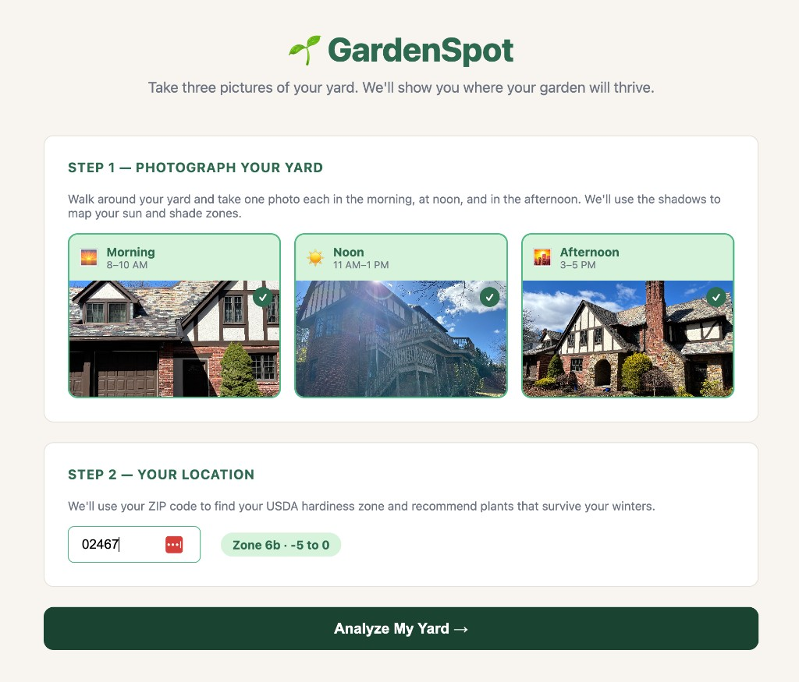
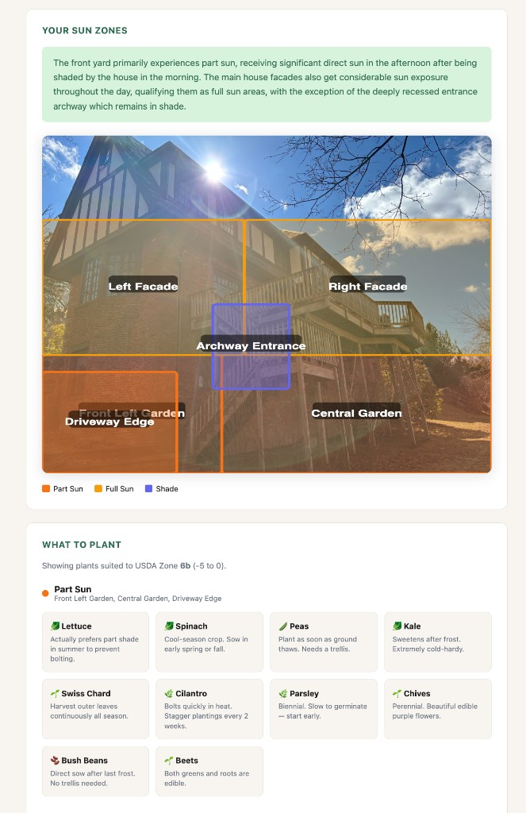

# 🌱 GardenSpot

**Take three pictures of your yard. GardenSpot maps sun and shade from your photos and suggests plants for your USDA hardiness zone.**

GardenSpot is a small [Next.js](https://nextjs.org/) app: you upload morning, noon, and afternoon yard photos (via [Cloudinary](https://cloudinary.com/)), enter your ZIP code for local winter limits, then run an **AI analysis** (Google Gemini) that returns structured sun zones and plant ideas tailored to each exposure.

---

## 📸 Screenshots

| 📷 Upload & analyze | 🗺️ Sun zones & plant picks |
| :---: | :---: |
|  |  |

---

## ✨ Features

- 📷 **Three-photo workflow** — Morning, noon, and afternoon shots so shadows reveal how light moves across the yard.
- 🌡️ **USDA zone lookup** — ZIP-based hardiness info for plant survival in your winters.
- 🤖 **Gemini vision analysis** — Interprets all three images and returns JSON: zone labels, approximate regions (as % of the image), confidence, and a short summary.
- 🎨 **Visual overlay** — Noon photo with semi-transparent rectangles and a color legend (full sun / part sun / shade).
- 🪴 **Plant suggestions** — Curated picks grouped by sun zone and filtered by your numeric USDA zone.

---

## 🧱 Tech stack

| Layer | Choice |
|--------|--------|
| ⚡ Framework | Next.js 14 (App Router) |
| 💠 UI | React 18, TypeScript |
| ☁️ Media upload | [next-cloudinary](https://next.cloudinary.dev/) upload widget |
| 🤖 AI | [@google/generative-ai](https://www.npmjs.com/package/@google/generative-ai) (Gemini, JSON schema for structured output) |
| 🗺️ Zone data | Static grow-zone helper (see `app/api/growzone`) |

---

## 🚀 Getting started

### 📋 Prerequisites

- **Node.js** 18+ (LTS recommended)
- 🔑 Accounts / keys for **Cloudinary** and **Google AI (Gemini)**

### 💻 Install & run

```bash
npm install
cp .env.example .env.local
# Edit .env.local with your Cloudinary and Gemini values.
npm run dev
```

Open [http://localhost:3000](http://localhost:3000) 🌐

### 🏗️ Production build

```bash
npm run build
npm start
```

---

## 🔑 Environment variables

Create **`.env.local`** in the project root (never commit it; it is listed in `.gitignore`).

| Variable | Required | Description |
|----------|----------|-------------|
| `NEXT_PUBLIC_CLOUDINARY_CLOUD_NAME` | ✅ Yes | Cloudinary cloud name (browser + widget). |
| `NEXT_PUBLIC_CLOUDINARY_UPLOAD_PRESET` | ✅ Yes | **Unsigned** upload preset for the widget. |
| `NEXT_PUBLIC_CLOUDINARY_API_KEY` | ✅ Yes* | Cloudinary API key (`NEXT_PUBLIC_*` so the upload widget can run in the browser). |
| `GEMINI_API_KEY` | ✅ Yes | From [Google AI Studio](https://aistudio.google.com/apikey). |
| `GEMINI_MODEL` | ➖ No | Override model id (default: `gemini-2.5-flash`). |

\*If uploads fail with API-key errors, ensure this matches the key shown in the Cloudinary console.

Optional: keep `CLOUDINARY_API_KEY` / `CLOUDINARY_API_SECRET` only for server-side scripts—do **not** prefix secrets with `NEXT_PUBLIC_`.

---

## ☁️ Deployment tips (e.g. Vercel)

- ⚙️ Add the same variables in the host’s **Environment** settings, including all `NEXT_PUBLIC_*` values.
- ✅ Confirm your Cloudinary **upload preset** exists on the same cloud as `NEXT_PUBLIC_CLOUDINARY_CLOUD_NAME` and allows **unsigned** uploads from your app origin.

---

## 📁 Project layout (high level)

```
app/
  page.tsx              # Main wizard UI
  api/analyze/route.ts  # Gemini multimodal + JSON schema
  api/growzone/[zip]/   # ZIP → USDA snippet
components/
  PhotoUploader.tsx     # Cloudinary widget + scroll restore
  ZoneOverlay.tsx       # SVG overlay on noon image
  PlantRecommendations.tsx
docs/screenshots/       # README images (committed)
```

---

## 🔒 Security

- 🚫 **Do not commit** `.env`, `.env.local`, or API secrets. Use `.gitignore` and rotate any key that was ever pushed to a remote.
- 👀 Treat `NEXT_PUBLIC_*` values as **visible to clients**; only put there what you are comfortable exposing.

---

🌻 Enjoy planning a sun-smart garden.
